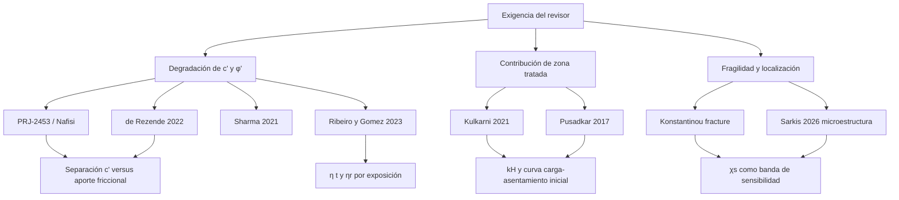

# Evidencia experimental útil para responder al revisor sobre zapatas MICP degradadas

## Resumen ejecutivo

El revisor pidió tres clases de evidencia que hoy no están resueltas por un único conjunto experimental: datos para la degradación de cohesión y ángulo de fricción, datos para la contribución de la zona tratada, y datos para un factor de fragilidad o localización, además de evidencia que haga menos especulativas las figuras prospectivas del manuscrito. 

La conclusión de la búsqueda es clara: no localicé un dataset público único que combine, en una misma campaña experimental, zapata MICP + degradación temporal controlada + medición independiente de \(c'\) y \(\phi'\) + observación de localización/post-pico. Lo que sí existe es un mosaico útil y defendible de evidencia primaria por componentes: un ancla footing-scale de corto plazo, datasets triaxiales o de stress-path para separar contribuciones cohesivas y friccionales, datasets de durabilidad/disolución para la pérdida de cementación, y datasets de fractura/microestructura para acotar la fragilidad de localización. Eso permite responder al revisor de forma rigurosa, pero como validación por componentes y no como validación física directa de zapatas MICP degradadas a lo largo del tiempo.  

La combinación más sólida para un suplemento, priorizando utilidad práctica para recalibrar el manuscrito, es esta: Kulkarni 2021 para capacidad portante y asentamiento inicial; DesignSafe PRJ-2453 / Nafisi et al. y de Rezende 2022 para separar la ganancia mecánica en términos de stress path, cohesión efectiva e incremento friccional; Sharma 2021 y el estudio complementario de freeze–thaw del mismo grupo para modelar retención temprana de resistencia; Ribeiro & Gomez 2023 para pérdida química de cementación; y Konstantinou et al. para una proxy seria de localización/fragilidad basada en tenacidad de fractura. La mejor lectura editorial de ese paquete es: Figura 2 y Figura 4 deben presentarse como “predicciones de escenario acotadas por evidencia de componentes”, no como validación directa de performance degradada de una zapata MICP.  

Para el parámetro \(\chi_s\), mi recomendación es tajante: no lo calibres como constante identificada. La mejor evidencia pública que encontré para ese frente proviene de ensayos de fractura y de microcaracterización de puentes de calcita. Konstantinou et al. midieron tenacidad de fractura en función del grado de cementación y mostraron que, a baja cementación, la zona de microgrietas crece hasta el punto de invalidar una lectura clásica de campo \(K\). Sarkis et al. mostraron heterogeneidad 3D de orientación y concentraciones localizadas de deformación en los enlaces de calcita. Eso sí justifica tratar \(\chi_s\) como banda de sensibilidad o criterio de descarte, pero no como parámetro directamente identificado para zapatas. 

## Criterio de búsqueda y selección

Con las herramientas disponibles en esta sesión hice una búsqueda web abierta y contrasté ese rastreo con el inventario bibliográfico ya reunido en tu paquete de resubmisión. No pude interrogar de forma directa los portales cerrados de Scopus o Web of Science desde aquí, por lo que en este informe distingo dos estados: “verificado públicamente ahora” cuando pude llegar a un registro abierto o a una landing page pública en esta sesión, y “corroborado en tu paquete” cuando el DOI, título o la trazabilidad del dataset quedaron confirmados en la documentación del paquete aunque no apareciera una página abierta adicional en esta misma búsqueda. Esa transparencia importa porque el revisor no solo pidió literatura: pidió datos que verdaderamente soporten decisiones de modelación. 

Usé como filtro principal la capacidad de cada candidato para responder, aunque sea parcialmente, a una de las tres preguntas del revisor: cómo degradan \(c'\) y \(\phi'\), cómo contribuye la zona tratada al mecanismo de capacidad, y qué evidencia permite acotar la localización/fragilidad. Como filtro secundario, privilegié datasets con algún nivel de reutilización real: repositorio con DOI, tablas suficientes para transcripción, o figuras con curvas claramente digitizables. En términos metodológicos, DesignSafe sí aparece como un entorno curado y orientado a datasets de ingeniería; y, por el lado de la física del material, los trabajos recientes muestran que la respuesta MICP depende de microestructura, temperatura, salinidad, oxígeno, pH y composición bacteriana local, lo que refuerza que no existe una degradación “por calendario” universal desacoplada del historial ambiental. 

## Matriz comparativa de datasets candidatos

La tabla siguiente está pensada para decidir qué incluir en el suplemento y qué uso permitir sin sobreafirmar el alcance. Cuando una dimensión aparece como “no especificado”, significa que esa precisión no quedó disponible en la metadata pública accesible en esta sesión y debe confirmarse al bajar el artículo o dataset completo.

| Dataset candidato | Confirmación | Ensayos y escala | Geometría reportada | Protocolo MICP | Variables medidas | Protocolo de degradación | Datos reutilizables | Utilidad principal |
|---|---|---|---|---|---|---|---|---|
| Kulkarni et al. 2021 | Corroborado en tu paquete | PLT + UCS + permeabilidad; laboratorio | Placas circulares y cuadradas de 50, 100 y 120 mm; para la curva ya digitizada, plate square 120×120 mm; H/B no aplica como capa tratada explícita | Método de cementación monofásica con bacteria + solución cementante; curado 3, 7 y 14 días | \(q_u\), asentamiento, BCR, SRF, UCS, permeabilidad | No; corto plazo | Figuras y tablas claramente digitizables; en tu paquete ya existe CSV derivado | Ancla footing-scale inicial para \(\eta_0\), rigidez de servicio y plausibilidad de \(k_H\) |
| Pusadkar et al. 2017 | Corroborado en tu paquete | Ensayo de strip footing sobre talud; laboratorio | Talud 1.5H:1V; setback 0B/B/2B; incubación 14 y 28 días; tamaño exacto del footing no especificado en la metadata accesible | MICP en arena tratada; detalle fino por confirmar al abrir artículo | UBC, BCR, curvas carga-asentamiento | No; corto plazo | Tablas y curvas digitizables | Chequeo geométrico secundario para sensibilidad de zona tratada, pero no sustituye una zapata sobre terreno horizontal |
| DesignSafe PRJ-2453 / Nafisi et al. | Corroborado en tu paquete; DesignSafe verificado públicamente como entorno curado | Triaxial drenado / stress-path; elemento | Probetas cilíndricas; dimensiones no especificadas aquí | Niveles variables de cementación y tamaño de partícula | Respuesta esfuerzo–deformación, stress path, niveles de cementación, tamaño de partícula, respuesta de corte | No degradación ambiental explícita | Dataset con DOI de repositorio + artículo relacionado | Separar incremento cohesivo y friccional; evita doble conteo al mapear \(c'\) y \(\phi'\) |
| de Rezende et al. 2022 | Corroborado en tu paquete | Triaxial; elemento | Probetas de triaxial; dimensiones por confirmar | Arena cementada por MICP | Esfuerzo desviador, presión de confinamiento, intercepto cohesivo | No | Artículo con curvas; digitización adicional requerida | Restringir \(c'_{b0}\) y \(\Delta \tan \phi\) con datos mecánicos más cercanos a Mohr–Coulomb |
| Sharma et al. 2021 Geoderma + paper complementario | Corroborado en tu paquete | Durabilidad de arena biocementada; elemento cilíndrico | Cilindros; dimensiones no especificadas aquí | Biocementación/hybrid bacteria según paper | UPV, módulo cortante, UCS, STS, pérdida de masa, retención | Wetting–drying, ageing y corrosión; en el paper complementario también freeze–thaw con porcentajes reportados | Curvas/valores transcribibles; en tu paquete ya hay una digitización base | Calibrar \(\lambda_E\), \(\eta_r\) y leyes de retención por exposición |
| Ribeiro & Gomez 2023 | Corroborado en tu paquete | Columnas de suelo + geofísica/geoquímica + modelo reactivo | Columnas de arena pobremente graduada; tamaño exacto no especificado aquí | MICP con ~5% de CaCO\(_3\) inicial | CaCO\(_3\), respuesta geoquímica/geofísica, secuencia de disolución | Sí: 0, 5, 10, 20 y 50 inyecciones ácidas | Serie de degradación claramente estructurada; tablas/figuras reutilizables | Mejor ancla para degradación química de \(\eta(t)\) y residual \(\eta_r\) |
| Konstantinou et al. 2023/2024 | Verificado públicamente ahora | Tenacidad de fractura modo I y mixto; laboratorio | Especímenes de laboratorio, no footing | MICP con distintos grados de cementación | \(K_{Ic}\) / tenacidad, resistencia, permeabilidad, porosidad | No ambiental; sí pérdida de robustez con baja cementación | PDF abierto vía arXiv; datos en figuras/tablas | Mejor proxy pública para \(\chi_s\) y fragilidad de localización |
| Sarkis et al. 2026 | Verificado públicamente ahora | Microtomografía + 3DXRD + DFXM; microescala | Contactos arena–calcita | Bio-cementación | Morfología, orientación cristalográfica, deformación inter e intragranular | No | PDF abierto vía arXiv | Base microestructural para justificar que la fragilidad depende de la arquitectura local de puentes de calcita |
| Talamkhani 2023 | Corroborado en tu paquete | Base compilada de UCS; literatura | No aplica | Variables de material, química y tratamiento | 402 UCS y ocho variables de entrada | Limitada | Si el paper contiene tabla completa o SI, es valioso; si no, sirve como envelope | Prior de resistencia y chequeo externo de rangos de CaCO\(_3\)–UCS |
| Ahmad et al. 2026 | Corroborado en tu paquete | Base compilada de UCS; literatura | No aplica | Variables geotécnicas, biológicas y químicas | 443 UCS y drivers dominantes | No degradación directa | Útil si el artículo trae tabla extensa o SI | Chequeo reciente independiente de qué variables dominan la resistencia |
| Tao et al. 2025 | Corroborado en tu paquete | Bearing-capacity style test + freeze–thaw; pequeño modelo/elemento | Geometría exacta por confirmar | MICP con fibras de palma | bearing capacity, espesor de costra, CaCO\(_3\), pérdida de masa y retención | Sí: freeze–thaw | Candidato interesante si el AE pide evidencia nueva de bearing + durabilidad | Dataset auxiliar; útil pero menos limpio por el refuerzo con fibras |

La lectura transversal de la matriz es esta: solo PRJ-2453 parece cruzar claramente el umbral de “repositorio de datos” verificable en esta sesión, mientras que la mayoría de los demás candidatos son artículos primarios con tablas o figuras suficientemente fuertes para digitalización rigurosa. Eso no los hace débiles; lo que cambia es el discurso editorial: deben presentarse como evidencia primaria extraíble y no como “raw CSV abierto ya depositado”. Además, la evidencia pública reciente confirma que el desempeño MICP es muy sensible a microestructura y ambiente: temperatura, salinidad, oxígeno, pH y microbiota local alteran la cinética de precipitación, la cantidad de carbonato y la resistencia final. 

## Recomendación de los cinco datasets clave

Esta es la selección que yo pondría sí o sí en el suplemento, con el uso exacto que sí puedes defender ante un AE exigente.

| Prioridad | Dataset | Por qué entra | Cómo usarlo sin sobreafirmar |
|---|---|---|---|
| Muy alta | Kulkarni 2021 | Es la evidencia más cercana al problema del manuscrito porque sí trabaja con PLT/carga-asentamiento y compara tratado vs no tratado | Ajustar \(\eta_0\), la curva carga–asentamiento de referencia y un \(k_H\) inicial acotado. No usarlo para degradación temporal porque no la mide |
| Muy alta | PRJ-2453 / Nafisi et al. | Es el mejor candidato con vocación real de dataset reutilizable y con stress-path/triaxial, que es justo lo que hace falta para no inventar \(c'\) y \(\phi'\) a partir de un solo BCR | Extraer un mapeo cementation level → incremento cohesivo vs friccional, y usarlo para que la degradación actúe sobre un estado de cementación medible, no sobre dos parámetros libres |
| Muy alta | Sharma 2021 | Da la pieza que le falta a Kulkarni: retención con exposición | Ajustar una ley de retención por ciclos o exposición, con \(\eta_r\) explícito. Muy útil para reescribir Figura 2 como función de exposición, no como ley universal en años |
| Alta | Ribeiro & Gomez 2023 | Introduce una degradación química controlada, con secuencia clara de ataques e interpretación geoquímica/geofísica | Calibrar una rama de degradación química agresiva de \(\eta(t)\). Sirve muy bien para escenarios severos o para un sobre de sensibilidad |
| Alta | Konstantinou et al. | Es la mejor pieza pública que encontré para el aspecto más débil del manuscrito: fragilidad y localización | No calibrar un único \(\chi_s\). Usarlo para construir bandas de fragilidad o reglas de descarte cuando la cementación cae por debajo de cierto umbral |

Si el editor insiste en una segunda prueba footing-scale, mi dataset sexto sería Pusadkar 2017. No lo dejé en el top 5 porque responde peor al caso base del manuscrito —es strip footing sobre talud, no zapata sobre terreno horizontal—, pero sí es útil para demostrar que la respuesta footing-scale a tratamiento biocementado cambia con la geometría del problema y que, por tanto, la función de contribución de zona tratada no debe venderse como universal. 

La decisión más importante, sin embargo, no es cuál entra quinto o sexto, sino cómo se usa cada uno. El error que el AE marcó fue de estructura epistemológica: el manuscrito tomó parámetros con grados de evidencia distintos y los llevó a un mismo nivel de confianza. La manera correcta de corregir eso es usar Kulkarni para el nivel footing inicial, Nafisi/de Rezende para separar mecánica efectiva, Sharma/Ribeiro para degradación de cementación, y Konstantinou/Sarkis para fragilidad. Esa arquitectura respeta mejor lo que sí muestran los datos disponibles.  

## Vacíos críticos y experimentos sugeridos

El vacío principal sigue intacto: no aparece públicamente una campaña que repita ensayos de capacidad portante sobre la misma configuración de zapata MICP después de una degradación controlada y, además, mida en paralelo el cambio de \(c'\), \(\phi'\), rigidez y patrón de localización. Ese es exactamente el hueco que el revisor te señaló. 

El segundo vacío es geométrico. Los datasets footing-scale localizados son útiles, pero no dan una malla limpia del tipo nivel footing + varias razones H/B + mismo suelo + mismo protocolo MICP + misma historia de degradación. Sin eso, cualquier ley universal de contribución de profundidad tratada debe presentarse como regla de screening acotada, no como ley experimentalmente identificada. La evidencia reciente sobre dependencia de la respuesta MICP respecto del entorno y la microestructura refuerza ese punto: un mismo contenido de carbonato no garantiza la misma respuesta mecánica si cambian morfología de puentes, temperatura, oxigenación o interacción con microbiota local. 

El tercer vacío es post-pico. Para \(\chi_s\), hoy la literatura pública abierta da mejores pistas en fractura y microestructura que en zapatas. Por eso, si el manuscrito quiere sobrevivir otra ronda, la formulación correcta es: \(\chi_s\) permanece no identificado y se usa como sensibilidad/falsificación, salvo que agregues una campaña nueva con DIC o tomografía post-ensayo, o una retrocalibración elasto-plástica convincente contra ensayos con localización observada. La propia literatura reciente sobre fractura en arenas biocementadas y sobre heterogeneidad interna de puentes de calcita muestra por qué ese parámetro difícilmente será universal. 

Si quisieras cerrar el hueco experimental de forma quirúrgica, yo propondría una campaña con tres bloques y no una sola familia de ensayos. El primer bloque sería zapata/placa en arena homogénea tratada con al menos cuatro razones \(H/B\) y medición completa de carga–asentamiento antes y después de ciclos de degradación. El segundo bloque sería element tests emparejados sobre material exhumado de las mismas probetas: triaxial drenado, corte directo y, si se puede, medición de ondas o rigidez dinámica. El tercero sería post-pico y localización, con DIC superficial o tomografía/RX para cuantificar bandas de deformación, pérdida de continuidad de puentes y energía de fractura residual. Así podrías convertir la arquitectura actual en un verdadero dataset V5.  

## DOI y notas de acceso

Aquí dejo las referencias que, en mi criterio, conviene poner en el suplemento con una leyenda muy simple: “raw data abierto”, “repositorio DOI”, o “figuras/tablas digitizables”.

| Recurso | DOI o identificador | Estado de acceso recomendado |
|---|---|---|
| Kulkarni et al. 2021 | `10.5614/j.eng.technol.sci.2021.53.6.2` | Bajar PDF del artículo; si no aparece CSV suplementario, usar Figura 6 y Table 6 para digitización controlada |
| Sharma et al. 2021 Geoderma | `10.1016/j.geoderma.2021.115359` | Resolver DOI y revisar article page/supplement; si no hay SI, transcribir curvas de retención |
| Sharma et al. 2021 complementario | `10.1177/1056789521991196` | Revisar abstract y artículo completo para los porcentajes de freeze–thaw; útil como serie corta de retención |
| DesignSafe dataset | `10.17603/ds2-t1v1-tf58` | Entrar por DOI de dataset; descargar archivos del proyecto y priorizar triaxial/stress-path |
| Nafisi et al. related article | `10.1007/s11440-021-01286-7` | Resolver DOI del artículo relacionado a PRJ-2453 |
| de Rezende et al. 2022 | `10.1007/s10706-021-02006-4` | Bajar artículo Springer; si no hay SI, digitizar curvas triaxiales y verificar el split cohesivo/friccional |
| Ribeiro & Gomez 2023 | `10.1061/JGGEFK.GTENG-11275` | Resolver DOI ASCE/JGGE; transcribir la secuencia 0/5/10/20/50 si no hay repositorio asociado |
| Pusadkar et al. 2017 | `10.9790/1684-140306100105` | Descargar del journal/DOI; transcribir tablas y curvas |
| Talamkhani 2023 | `10.1155/2023/3692090` | Verificar si la tabla completa de 402 casos está en el paper o material suplementario |
| Ahmad et al. 2026 | `10.1080/01490451.2026.2663806` | Revisar si el paper trae tabla extensa o dataset suplementario |
| Tao et al. 2025 | `10.1371/journal.pone.0332051` | Revisar Supporting Information del artículo PLOS; si está completa, puede ser muy útil como bearing + freeze–thaw |
| Temperature-dependent MICP | `10.1007/s11440-022-01664-9` | Journal DOI expuesto en la landing pública del preprint; buen apoyo para exposición ambiental y cinética  |
| Recent environmental optimization paper | `10.1061/JGGEFK/GTENG-12230` | Journal DOI expuesto en la landing pública del preprint; útil para jerarquizar drivers ambientales  |
| On-site bacteria influence paper | `10.1061/JGGEFK/GTENG-12338` | Journal DOI expuesto en la landing pública del preprint; muy útil para argumentar dependencia de sitio y pH  |

Mi recomendación editorial final es esta: en el suplemento no presentes una sola “tabla de validación”, sino una tabla de trazabilidad parámetro–dataset–alcance. Eso permite decir, con honestidad y precisión, qué queda calibrado, qué queda acotado, qué solo queda sensibilizado, y qué sigue no identificado. Esa estructura es la que mejor responde a la objeción del AE sin fingir que ya existe una validación directa de zapatas MICP degradadas que, al menos en la búsqueda pública hecha aquí, no apareció. 